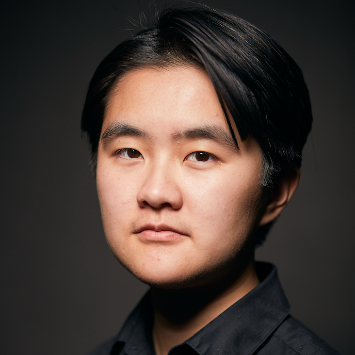
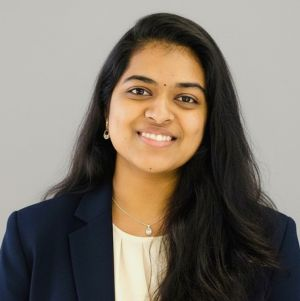


Undergraduate or Masters student at UCSD? Join our lab!
We will host an info session on Oct 2 and applications are due 11:59pm on Oct 3.
Please check out our [apply page](apply) for more details.
{: .notice }


[slides]: https://docs.google.com/presentation/d/16P53-4IwcPSB7odugjL5Os5JyOCqRlImbf6GZAYs_ao/edit?usp=sharing

The Data Science Teaching and Learning Lab (DSTL, pronounced "distill") at UCSD
conducts research studies and prototypes novel tools for teaching and learning
data science. The overarching goal of our group is to discover how instructors
use (or struggle to use!) software tools to accomplish the many tasks of
teaching, and design new tools that can improve the lives of data science
instructors everywhere.


Teaching data science is hard! Instructors design learning
materials, oversee course staff, maintain infrastructure, and integrate new
discoveries in an rapidly-evolving field, all under the constraints of their
academic calendar.


**What we do:** Our group applies methods from [Human-Computer Interaction
(HCI)][hci] to understand how instructors use software by conducting interviews
and usability studies. We also build and maintain software tools like [Pandas
Tutor][pt], used by over 20,000 people per year.

[hci]: https://www.interaction-design.org/literature/topics/human-computer-interaction
[pt]: https://pandastutor.com/

**Who we are:** Our group is led by professor [Samuel Lau][sam] in the
Halıcıoğlu Data Science Institute at UC San Diego and a small (but mighty!) team
of students:

  

  

    
  **Devon Tao**  
  *1st year Data Science PhD*  
  [Website](https://devontao.github.io/) 
  

  

    
  **Minchan Kim**  
  *Project Lead*
  

  

  
  **Michelle Hong**  
  

  

  

  

    
  **Andrew Hudson Yang**  
  *Project Lead*  
  

  

    
  **Ayush Shah**  
  

  

  
  **Xinyuan(Ella) Li** 
  *2nd year Data Science* 
  [Website](https://ellali86.github.io/portfolio/)
  

  

  

  

    
  **Sathvika Goriparthy**  
  *Project Lead*
  

  

    
  **Achintya Rai**  
  

  

Lab alumni and former members:

<ul class="team-list">
  <li>Gabriel Cha</li>
  <li>Christopher Lum</li>
  <li>Owen Miller</li>
  <li>Parna Praveen</li>
  <li>Ylesia (Yi Xing) Wu</li>
  <li>Guoxuan (Jason) Xu</li>
  <li>Qirui (Sara) Zheng</li>
</ul>

[sam]: https://lau.ucsd.edu
